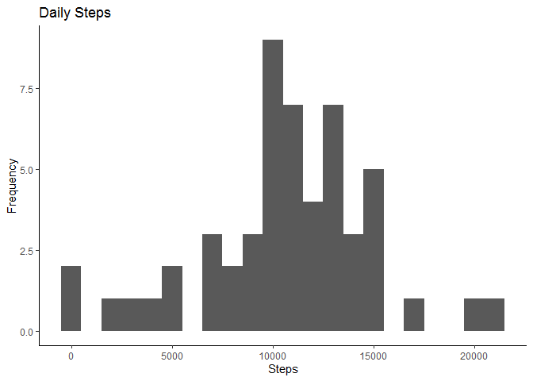

This assignment makes use of data from a personal activity monitoring device. This device collects data at 5 minute intervals through out the day. The data consists of two months of data from an anonymous individual collected during the months of October and November, 2012 and include the number of steps taken in 5 minute intervals each day.

The data for this assignment can be downloaded from the course web site:

* Dataset: [Activity monitoring data](https://d396qusza40orc.cloudfront.net/repdata%2Fdata%2Factivity.zip)

## Loading and preprocessing the data
Load the package
Read the data from your working directory to obtain a csv file.


```r
library("data.table")
library(ggplot2)

activitydata <- data.table::fread(input = "activity.csv")
```


## What is mean total number of steps taken per day?
* number of steps taken per day


```r
Total_Steps <- activitydata[, c(lapply(.SD, sum, na.rm = FALSE)), .SDcols = c("steps"), by = .(date)] 
head(Total_Steps, 10)
```

```
##           date steps
##  1: 2012-10-01    NA
##  2: 2012-10-02   126
##  3: 2012-10-03 11352
##  4: 2012-10-04 12116
##  5: 2012-10-05 13294
##  6: 2012-10-06 15420
##  7: 2012-10-07 11015
##  8: 2012-10-08    NA
##  9: 2012-10-09 12811
## 10: 2012-10-10  9900
```

* Histogram of the total number of steps taken each day 


```r
ggplot(Total_Steps, aes(x = steps)) +
    geom_histogram(binwidth = 1000) +
    labs(title = "Daily Steps", x = "Steps", y = "Frequency")+
  theme_classic()
```

```
## Warning: Removed 8 rows containing non-finite values (stat_bin).
```

<!-- -->

* mean and median of steps taken per day

```r
Total_Steps[, .(Mean_Steps = mean(steps, na.rm = TRUE), Median_Steps = median(steps, na.rm = TRUE))]
```

```
##    Mean_Steps Median_Steps
## 1:   10766.19        10765
```


## What is the average daily activity pattern?

* Time series plot of the average number of steps taken


```r
IntervalDT <- activitydata[, c(lapply(.SD, mean, na.rm = TRUE)), .SDcols = c("steps"), by = .(interval)] 
ggplot(IntervalDT, aes(x = interval , y = steps)) + geom_line(color="black", size=1) + labs(title = "Average Daily Steps", x = "Interval", y = "Avg. Steps per day") + theme_classic()
```

<!-- -->

* The 5-minute interval that, on average, contains the maximum number of steps


```r
IntervalDT[steps == max(steps), .(max_interval = interval)]
```

```
##    max_interval
## 1:          835
```


## Imputing missing values
* Code to describe and show a strategy for imputing missing data
1. count missing values in the dataset


```r
activitydata[is.na(steps), .N ]
```

```
## [1] 2304
```

2. Filling the missing values


```r
activitydata[is.na(steps), "steps"] <- activitydata[, c(lapply(.SD, median, na.rm = TRUE)), .SDcols = c("steps")]
```

3. Create a new dataset with no missing values.


```r
data.table::fwrite(x = activitydata, file = "tidyData.csv", quote = FALSE)
```

* Histogram of the total number of steps taken each day after missing values are imputed


```r
ggplot(Total_Steps, aes(x = steps)) + geom_histogram(fill = "black", binwidth = 1000) + labs(title = "Daily Steps", x = "Steps", y = "Frequency") + theme_classic()
```

```
## Warning: Removed 8 rows containing non-finite values (stat_bin).
```

<!-- -->

```r
Total_Steps <- activitydata[, c(lapply(.SD, sum)), .SDcols = c("steps"), by = .(date)] 
Total_Steps[, .(Mean_Steps = mean(steps), Median_Steps = median(steps))]
```

```
##    Mean_Steps Median_Steps
## 1:    9354.23        10395
```

Type of Estimate | Mean_Steps | Median_Steps
--- | --- | ---
First (with NA) | 10765 | 10765
Second (fillin in missing value) | 9354.23 | 10395


## Are there differences in activity patterns between weekdays and weekends?

1. Create a new factor variable in the dataset with two levels – “weekday” and “weekend” indicating whether a given date is a weekday or weekend day.


```r
activitydata <- data.table::fread(input = "activity.csv")
activitydata[, date := as.POSIXct(date, format = "%Y-%m-%d")]
activitydata[, `Day of Week`:= weekdays(x = date)]
activitydata[grepl(pattern = "Monday|Tuesday|Wednesday|Thursday|Friday", x = `Day of Week`), "weekday or weekend"] <- "weekday"
activitydata[grepl(pattern = "Saturday|Sunday", x = `Day of Week`), "weekday or weekend"] <- "weekend"
activitydata[, `weekday or weekend` := as.factor(`weekday or weekend`)]
head(activitydata, 10)
```

```
##     steps       date interval Day of Week weekday or weekend
##  1:    NA 2012-10-01        0      Monday            weekday
##  2:    NA 2012-10-01        5      Monday            weekday
##  3:    NA 2012-10-01       10      Monday            weekday
##  4:    NA 2012-10-01       15      Monday            weekday
##  5:    NA 2012-10-01       20      Monday            weekday
##  6:    NA 2012-10-01       25      Monday            weekday
##  7:    NA 2012-10-01       30      Monday            weekday
##  8:    NA 2012-10-01       35      Monday            weekday
##  9:    NA 2012-10-01       40      Monday            weekday
## 10:    NA 2012-10-01       45      Monday            weekday
```

Panel plot comparing the average number of steps taken per 5-minute interval across weekdays and weekend


```r
activitydata[is.na(steps), "steps"] <- activitydata[, c(lapply(.SD, median, na.rm = TRUE)), .SDcols = c("steps")]
IntervalDT <- activitydata[, c(lapply(.SD, mean, na.rm = TRUE)), .SDcols = c("steps"), by = .(interval, `weekday or weekend`)] 
ggplot(IntervalDT , aes(x = interval , y = steps, color=`weekday or weekend`)) + geom_line() + labs(title = "Avg. Daily Steps by Weektype", x = "Interval", y = "No. of Steps") + facet_wrap(~`weekday or weekend` , ncol = 1, nrow=2) + theme_classic()
```

<!-- -->
